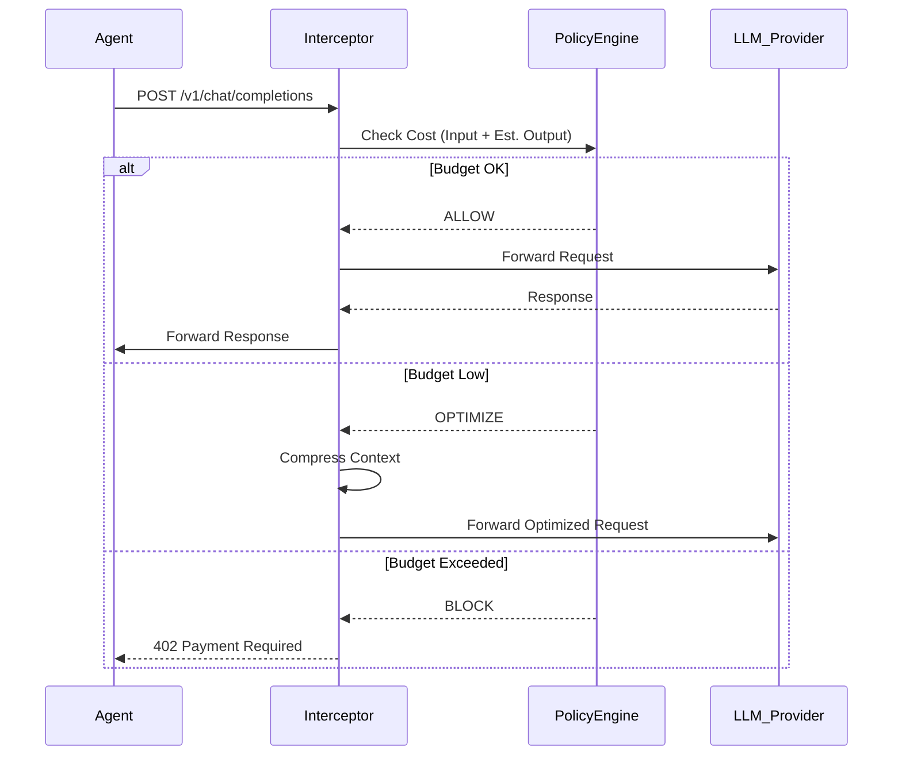

# 🏗️ Architecture: BudgetSentry

BudgetSentry operates as a middleware layer between the Agent Runtime and the Model Provider (LLM API).

## 🧩 Core Modules

### 1. The Interceptor (Gateway)
The first line of defense. It sits on the network egress path.

*   **Role:** Proxies all API calls.
*   **Function:**
    *   Parses the outgoing request body.
    *   Calculates token count (input).
    *   Estimates completion tokens (based on `max_tokens`).
    *   Calculates projected cost.
*   **Decision Engine:** Compares projected cost against the `Wallet` state. Returns `ALLOW`, `WARN`, or `BLOCK`.

### 2. The Optimizer (Compression Engine)
Activated when the budget is tight (Yellow/Red state).

*   **Role:** Reduces payload size without losing semantic meaning.
*   **Strategies:**
    *   **Lossless:** Whitespace removal, JSON minification.
    *   **Lossy:** Summarization of older messages in the conversation history.
    *   **RAG Filtering:** Removes retrieved documents with low relevance scores before they hit the context window.

### 3. The Dashboard (Telemetry)
The user interface for monitoring and control.

*   **Tech Stack:** Next.js + WebSocket (for real-time updates).
*   **Data Flow:**
    *   Interceptor emits events -> Redis Stream.
    *   Dashboard consumes Redis Stream -> Updates UI.
*   **Features:**
    *   Emergency Stop Button (Global Kill Switch).
    *   Budget Top-up integration.
    *   Per-Agent cost attribution.

## 🔄 Data Flow Diagram

